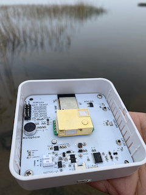

# himinds-env-sensor-hw
HiMinds Open Source Wireless Environmental Sensor HW.

## Rev B (G2)
The second generation of the hardware is based on the first version of the hardware but we have made several improvements. It is a rechargeable battery-operated wireless sensor that can measure:

* Carbon dioxide (CO₂) levels
* Temperature with ±1.0°C accuracy
* Barometric pressure with 1 hPa absolute accuracy
* Humidity with ±3% accuracy
* Volatile organic compounds (VOC) gas sensor
* Tamper detection
* Sound level meter 

The project is described in our [Medium articles](https://medium.com/himinds/himinds-wireless-environmental-sensor-gen-2-part-1-requirements-37ee416b31b).

The enclosure is called CBRS01VWH and is made by [CamdenBoss](https://www.camdenboss.com/). 

## Rev A (G1)

The first version of the hardware, was based on the work done by OLIMEX. Link to their [project page](https://github.com/OLIMEX/ESP32-DevKit-LiPo)
For other credits please refer to our [Medium ariticles](https://medium.com/himinds/open-source-wireless-environmental-sensor-part-1-requirements-8598c5b5f503).

## Open Source Hardware
The hardware is certified by OSHWA’s Open Source Hardware Certification program.
It is the first certification given to a Swedish project. 
* Rev A (Version 1.0) [OSHWA certification](https://certification.oshwa.org/se000001.html)
* Rev B (Version 2.0) [OSHWA certification](https://certification.oshwa.org/se000007.html)

## License
* Hardware is released under Apache 2.0 License
* Documentation is released under CC BY-SA 3.0

## Disclaimer of Warranties and Limitation of Liability. (from CC 3.0)

### Representations, Warranties and Disclaimer

UNLESS OTHERWISE MUTUALLY AGREED TO BY THE PARTIES IN WRITING, LICENSOR OFFERS THE WORK AS-IS AND MAKES NO REPRESENTATIONS OR WARRANTIES OF ANY KIND CONCERNING THE WORK, EXPRESS, IMPLIED, STATUTORY OR OTHERWISE, INCLUDING, WITHOUT LIMITATION, WARRANTIES OF TITLE, MERCHANTIBILITY, FITNESS FOR A PARTICULAR PURPOSE, NONINFRINGEMENT, OR THE ABSENCE OF LATENT OR OTHER DEFECTS, ACCURACY, OR THE PRESENCE OF ABSENCE OF ERRORS, WHETHER OR NOT DISCOVERABLE. SOME JURISDICTIONS DO NOT ALLOW THE EXCLUSION OF IMPLIED WARRANTIES, SO SUCH EXCLUSION MAY NOT APPLY TO YOU.

### Limitation on Liability. 
EXCEPT TO THE EXTENT REQUIRED BY APPLICABLE LAW, IN NO EVENT WILL LICENSOR BE LIABLE TO YOU ON ANY LEGAL THEORY FOR ANY SPECIAL, INCIDENTAL, CONSEQUENTIAL, PUNITIVE OR EXEMPLARY DAMAGES ARISING OUT OF THIS LICENSE OR THE USE OF THE WORK, EVEN IF LICENSOR HAS BEEN ADVISED OF THE POSSIBILITY OF SUCH DAMAGES.
